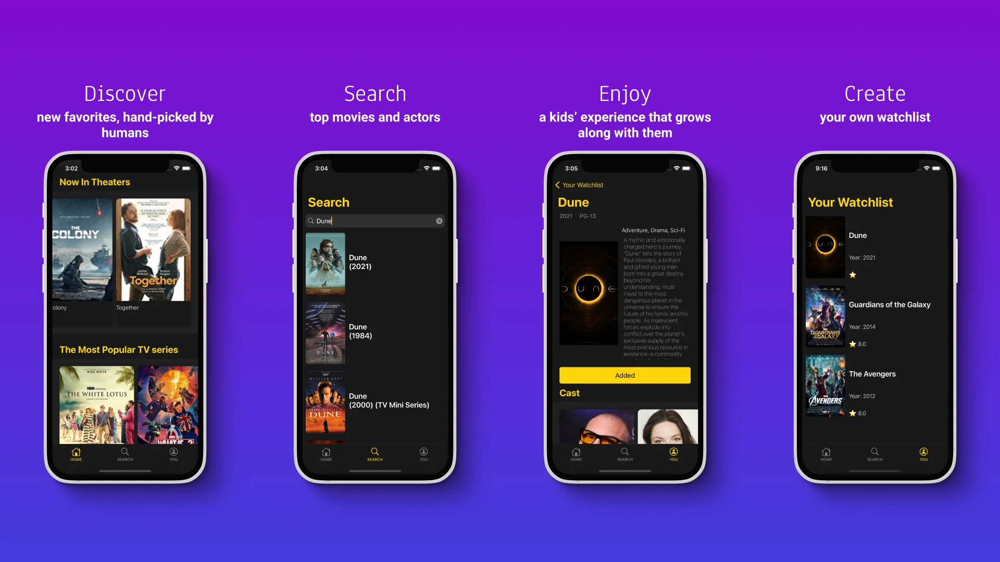

# MovieTimeApp

# Description
This is an application for viewing information about films, it is possible to view the biographies of actors. And also save them in your watchlist, so as not to forget. It uses the imdb API service.

## Built With
- Swift
- UIKit
- Firebase
- Combine
- REST API

## Author
**Evgenii Kolgin**

- [Profile](https://github.com/Colgates "Evgenii Kolgin")
- [Email](mailto:kolgin.ev@gmail.com?subject=Hi% "Hi!")
- [Website](https://evgeniikolgin.ru "Welcome")

## 🤝 Support
Contributions, issues, and feature requests are welcome!
Give a ⭐️ if you like this project!
